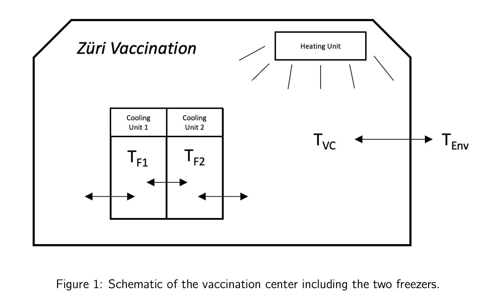

In this repository we show the mini project of course Model predictive control. Basically we implement a variety of MPC controllers for the temperature regulation of a vaccination center: The center offers two types of vaccines, each stored in a separate freezer as the required storage temperatures are different. The vaccination center is illustrated in Figure 1 and consists of the following elements.

Due to the confidentiality of the code we only show the statement and report here. If you are interested in more detail, feel free to contact me email: qimaqi@ethz.ch

 
